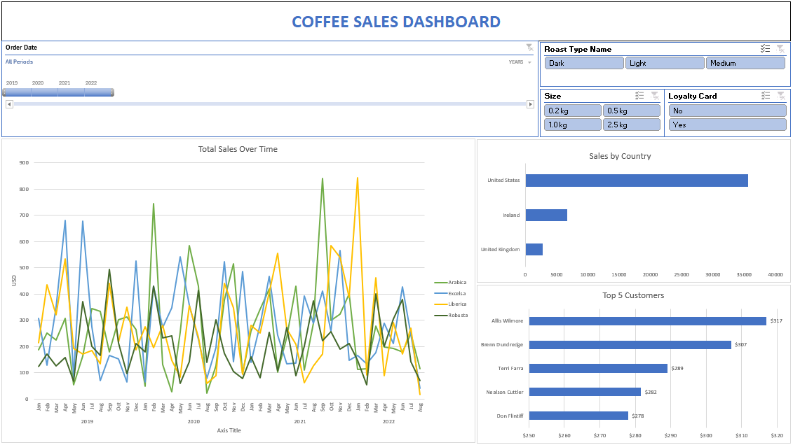

# Coffee Sales Dashboard

An **interactive Excel dashboard** to analyze coffee sales across countries, customers, and time periods.

## 📊 Features
- Sales trends over time by coffee type (Arabica, Excelsa, Liberica, Robusta).  
- Sales breakdown by country.  
- Top 5 customers ranking.  
- Interactive filters (roast type, size, loyalty card, year).  

## Preview

## How to Use
1. Open `Coffee_Sales_Dashboard.xlsx` in Excel (2016+ recommended).  
2. Use slicers to explore sales data interactively.  

---
